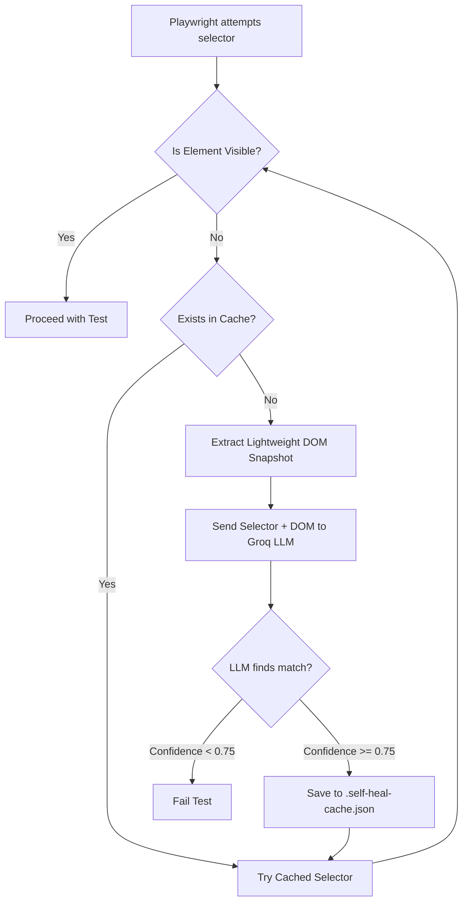

# 🎭 Wikipedia Playwright

> End-to-end test suite for [Wikipedia](https://www.wikipedia.org/) built with [Playwright](https://playwright.dev/) and TypeScript, following the **Page Object Model (POM)** pattern.

---

## 📋 Table of Contents

- [Overview](#-overview)
- [Project Structure](#-project-structure)
- [Prerequisites](#-prerequisites)
- [Installation](#-installation)
- [Configuration](#-configuration)
- [Running Tests](#-running-tests)
- [Test Suites](#-test-suites)
- [Page Objects](#-page-objects)
- [Self-Healing Locators](#-self-healing-locators-groq-llm)


---

## 🔍 Overview

This project automates key user flows on Wikipedia using Playwright + TypeScript. It leverages the **Page Object Model** to keep tests clean, readable, and maintainable.

| Tech | Version |
|------|---------|
| [@playwright/test](https://playwright.dev/) | ^1.61.1 |
| [TypeScript](https://www.typescriptlang.org/) | ^6.0.3 |
| [dotenv](https://github.com/motdotla/dotenv) | ^17.4.2 |
| Node.js | >= 18 |

---

## 📁 Project Structure

```
wikipedia-playwright/
├── pages/                   # Page Object Model classes
│   ├── HomePage.ts          # Search, font size, login navigation
│   ├── LanguagePage.ts      # Language selection on landing page
│   └── LoginPage.ts         # Login form interactions
├── tests/                   # Test specs
│   ├── home.spec.ts         # Home page tests (font size)
│   ├── login.spec.ts        # Login tests (valid & invalid)
│   └── search.spec.ts       # Search functionality tests
├── .env                     # Environment variables (not committed)
├── playwright.config.ts     # Playwright configuration
├── tsconfig.json            # TypeScript configuration
└── package.json
```

---

## ✅ Prerequisites

- [Node.js](https://nodejs.org/) >= 18
- npm >= 9

---

## 📦 Installation

```bash
# 1. Clone the repository
git clone https://github.com/your-username/wikipedia-playwright.git
cd wikipedia-playwright

# 2. Install dependencies
npm install

# 3. Install Playwright browsers
npx playwright install
```

---

## ⚙️ Configuration

### Environment Variables

Create a `.env` file in the root of the project:

```env
WIKIPEDIA_USERNAME=your_wikipedia_username
WIKIPEDIA_PASSWORD=your_wikipedia_password
```

> **Note:** Credentials are only required for the **valid login** test. If they are not set, that test will be automatically skipped.

### Playwright Config

The base URL is set to `https://www.wikipedia.org/` and tests run on **Chromium** by default. Retries and workers are automatically adjusted for CI environments.

---

## 🚀 Running Tests

```bash
# Run all tests
npx playwright test

# Run a specific test file
npx playwright test tests/login.spec.ts

# Run tests in headed mode (watch the browser)
npx playwright test --headed

# Open the HTML report after a run
npx playwright show-report
```

---

## 🧪 Test Suites

### 🏠 `home.spec.ts` — Home Page

| Test | Description |
|------|-------------|
| `Size heading test` | Verifies that font sizes increase correctly: Small < Standard < Large |

### 🔐 `login.spec.ts` — Login

| Test | Description |
|------|-------------|
| `Invalid login` | Submits wrong credentials and asserts the error message is shown |
| `Valid login` | Logs in with `.env` credentials and verifies the user is redirected and their username is displayed |

### 🔎 `search.spec.ts` — Search

| Test | Description |
|------|-------------|
| `Search for a term` | Types a term in the search box and selects a result from the autocomplete dropdown |

---

## 🗂️ Page Objects

### `LanguagePage`
Handles navigation to the Wikipedia landing page and language selection.

```typescript
await languagePage.goTo();
await languagePage.selectLanguage('English');
```

### `HomePage`
Handles search, font size checks, and navigation to login.

```typescript
await homePage.search('Playwright (software)');
await homePage.goToLogin();
const { small, standard, large } = await homePage.getFontSizes();
```

### `LoginPage`
Handles the login form and error message retrieval.

```typescript
await loginPage.login(username, password);
const error = await loginPage.getErrorMessage();
```

---

## 🩹 Self-Healing Locators (Groq LLM)

This project contains an experimental **Self-Healing Locator** implementation located under the `self-healing/` directory. It uses the **Groq SDK** (`llama-3.1-8b-instant`) to dynamically repair broken selectors during test execution.

### 🧠 How it Works



1. **Lightweight DOM Snapshot (`domSnapshot.ts`)**: Instead of sending the full HTML, we extract only interactive elements (buttons, inputs, links) to avoid exceeding LLM context and token limits.
2. **LLM Healing (`llmHealer.ts`)**: We send the broken selector along with the snapshot to Groq, which returns a structured JSON suggesting a valid selector.
3. **Caching (`healCache.ts`)**: Saves successful mappings to `.self-heal-cache.json` (ignored by Git) so subsequent test runs reuse the fixed selector instantly.
4. **Wrapper (`healedLocator.ts`)**: The orchestrator which tests import instead of using standard `page.locator()`.

### 🧪 Running the Self-Healing Test

The test file `tests/self-healing-login.spec.ts` executes a login flow using **intentionally broken selectors** (e.g., `#wpNameXYZ` instead of `#wpName1`).

To run it:

```bash
# Make sure your GROQ_API_KEY is configured in your .env file
npx playwright test tests/self-healing-login.spec.ts
```

* **First run**: You will see warnings in the console showing the healing process and API calls to Groq. A `.self-heal-cache.json` file will be generated at the root.
* **Second run**: The test runs immediately without calling the LLM since the locators are resolved from the local cache.